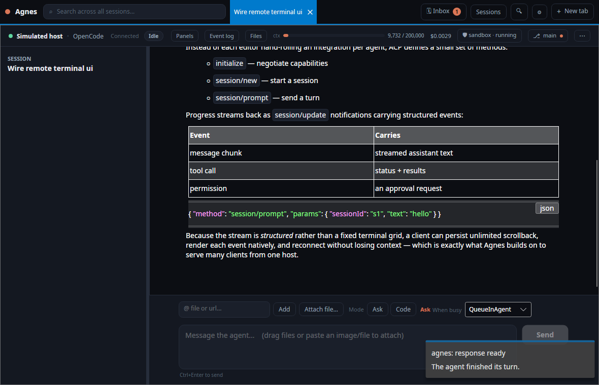
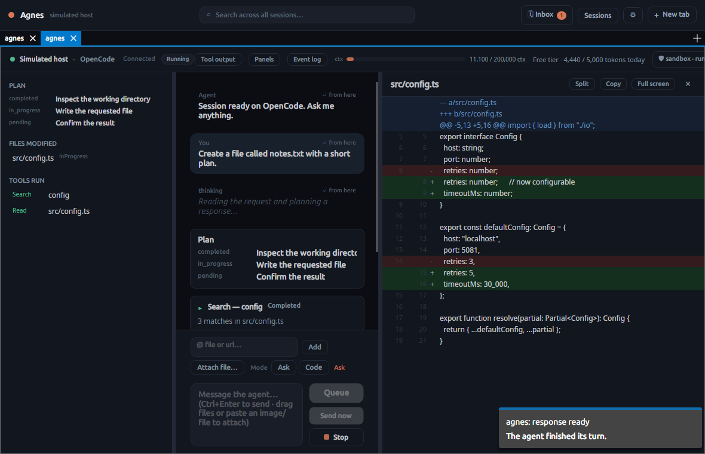
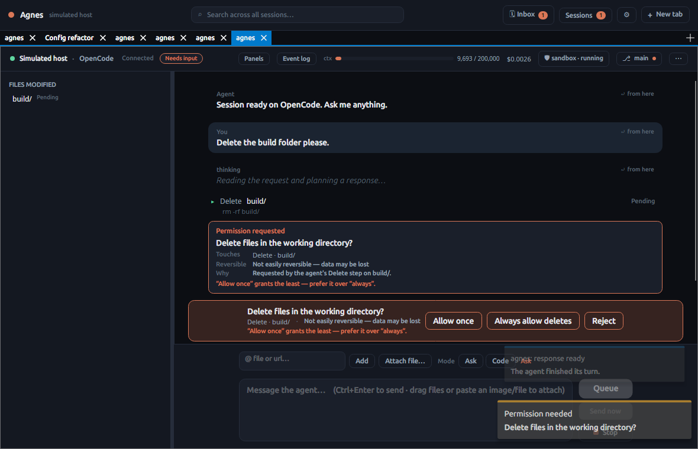
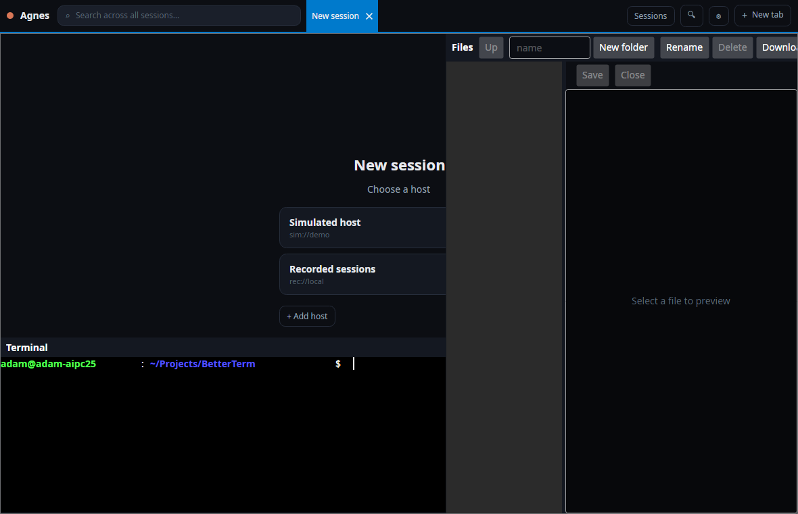
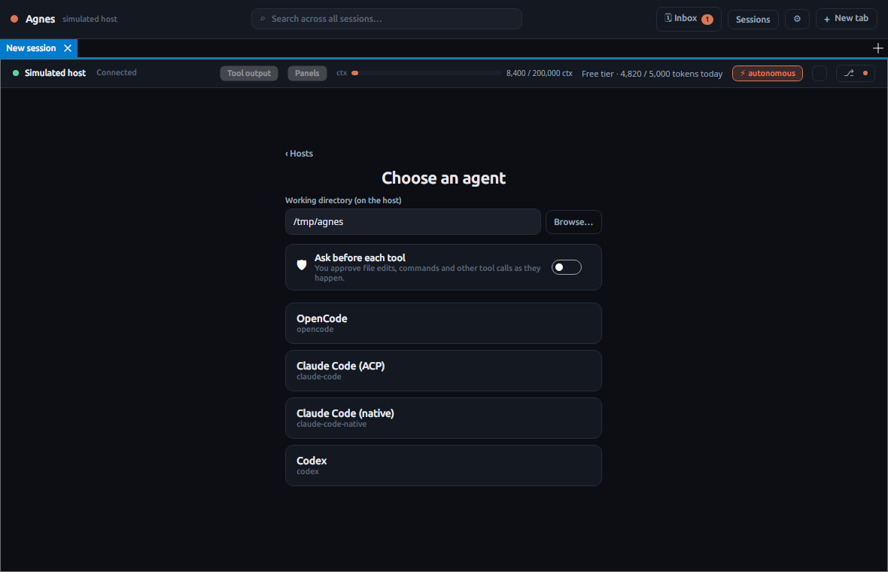
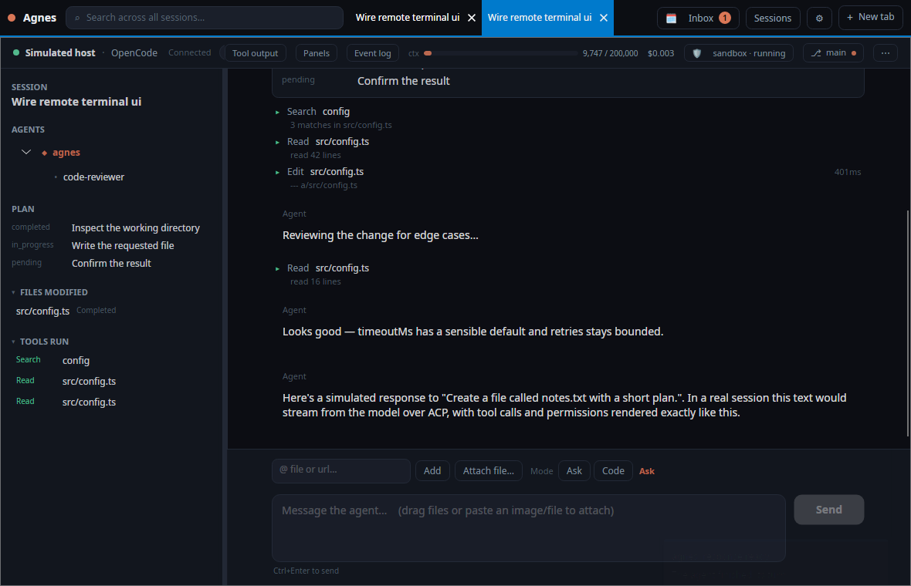
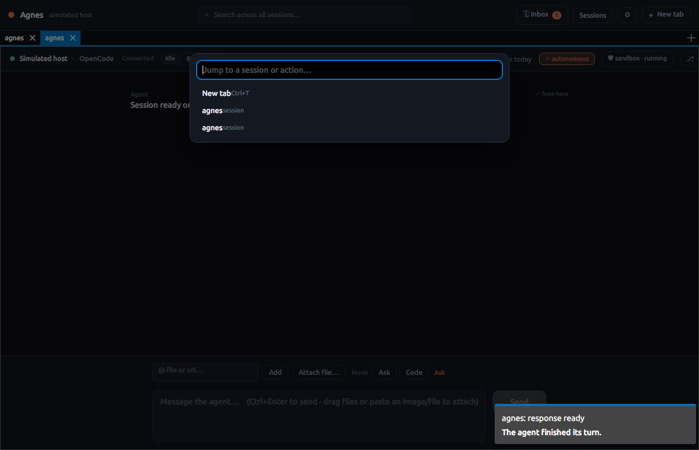
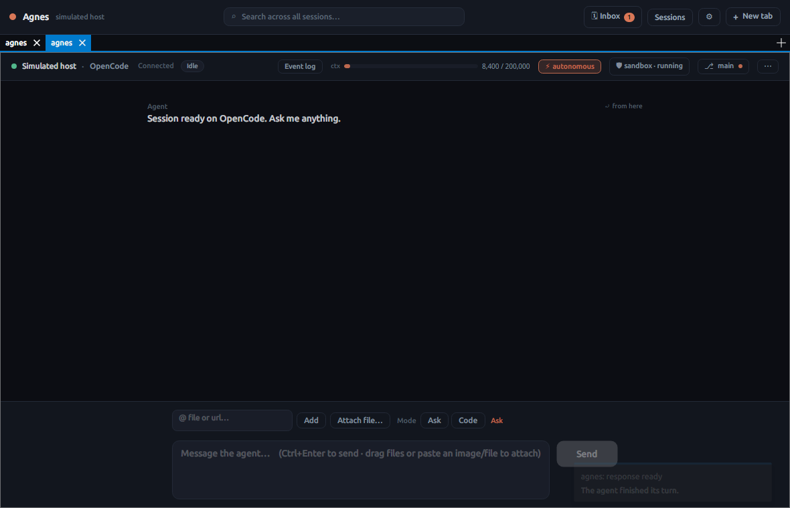
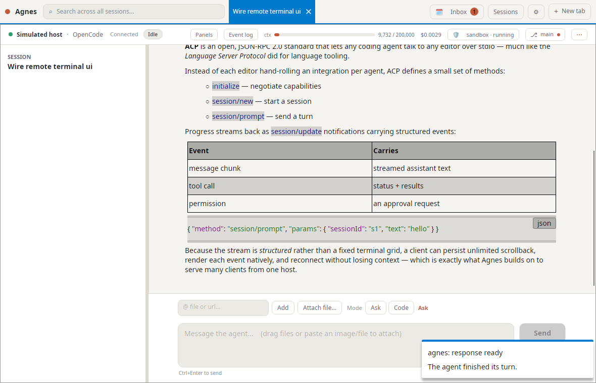

# Agnes

**A remote interface to coding CLIs.** Run one **host** where your coding agents live (Claude Code, OpenCode, and Codex today); connect from **many clients** — a full-featured desktop app plus web and mobile (Android). Think `claude` in `tmux` + `ssh`, but without tmux's limits: no fixed character grid, unlimited server-side scrollback, and each client renders at its own size.

> Status: **alpha**. Working today: event-sourced sessions with restart-resume, per-device pairing auth over TLS, an Avalonia desktop client, a browser (WASM) client served by the host, and optional per-session Incus VM sandboxing. See [`docs/architecture.md`](docs/architecture.md) and [`docs/deployment.md`](docs/deployment.md).



## Why

Coding CLIs are great locally but awkward to reach remotely. The usual answer — `tmux` + `ssh` — couples every client to a single fixed terminal grid, mangles scrollback, and breaks when window sizes differ.

Agnes runs each CLI in its **[Agent Client Protocol](https://agentclientprotocol.com) (ACP)** mode, a JSON-RPC 2.0 stream of *structured* events (message chunks, tool calls, diffs, plans, permission requests) rather than a character grid. The host normalizes that stream into an **event-sourced session log**, so:

- **Unlimited scrollback**, stored on the host — and sessions (with their history) survive a host restart; the agent re-attaches on the next prompt.
- **Many clients, one session** — each connects and gets a snapshot + live tail; reconnects replay from a cursor.
- **Native, reflowable rendering** at each client's own size and form factor.
- **Ask-first permissions** — the agent requests approval per tool call (surfaced in the UI); an autonomous mode is opt-in per session, and agents can be isolated in per-session Incus VMs.
- **MCP servers**, managed from the UI, can run on the host or be forwarded into a sandbox; sandbox images can also be baked ahead of time so a session's tools are ready the moment it starts.

## Screenshots

<table>
<tr>
<td width="50%"><br><sub><b>Multi-column workspace</b> — plan, files &amp; tools (left), chat (middle), and a full diff (right), all resizable.</sub></td>
<td width="50%"><br><sub><b>Ask-first permissions</b> — a rich approval card per tool call: what it touches, whether it's reversible, and why.</sub></td>
</tr>
<tr>
<td><br><sub><b>Connect to a host</b> — per-device pairing; the host is a per-tab choice, so one window can span several.</sub></td>
<td><br><sub><b>Pick an agent</b> — agents not installed on the host are greyed out.</sub></td>
</tr>
<tr>
<td><br><sub><b>Per-session sandboxing</b> — isolate an agent in an Incus VM; pause, resume, or delete it from the status bar.</sub></td>
<td><br><sub><b>Command palette</b> (Ctrl+K) — keyboard-navigable jump to a session or action.</sub></td>
</tr>
<tr>
<td><br><sub><b>Autonomous mode</b> — opt-in per session; the ⚡ chip surfaces it and switches the agent's live mode.</sub></td>
<td><br><sub><b>Light &amp; dark themes</b> — applied live, without restarting a session.</sub></td>
</tr>
</table>

The [`screenshots/`](screenshots) folder has the full set — rewind-to-here, split diff, sub-agent tree, raw event log, prompt queue, in-session search, session management, multi-window detach, and restore-on-relaunch. They're generated from the real UI (against an offline simulated host) with `dotnet run --project tools/Agnes.Screenshots`.

## Architecture at a glance

```
Host daemon ── spawns each CLI (ACP mode, or a native stream-json adapter)
            ── normalizes updates -> event-sourced log (SQLite) + session catalogue
            ── ASP.NET Core + SignalR hub (TLS + per-device pairing tokens)
                     │  Agnes wire protocol
   Clients ── Agnes.Client connection pool (many hosts, dozens of agents)
            ── Avalonia desktop app · Uno web (WASM) + Android heads
```

Full design: [`docs/architecture.md`](docs/architecture.md).

## Repository layout

| Project | Role |
| --- | --- |
| `src/Agnes.Abstractions` | Plugin & domain contracts (`IAgentAdapter`, `SessionEvent`, …) |
| `src/Agnes.Acp` | Generic ACP-over-stdio client (on StreamJsonRpc) — reused by every agent |
| `src/Agnes.Agents.ClaudeCode` | Reference agent plugin (launch descriptor for Claude Code's ACP endpoint) |
| `src/Agnes.Protocol` | Transport-agnostic host↔client wire contract |
| `src/Agnes.Agents.OpenCode` / `Agnes.Agents.Native` | OpenCode ACP adapter; native stream-json adapter (Claude Code) |
| `src/Agnes.Host` | ASP.NET Core daemon: plugins, session manager, event store, device auth, SignalR hub |
| `src/Agnes.Client` | Reusable client library: multi-host connection pool, snapshot+tail, device pairing |
| `src/Agnes.Sandbox` / `Agnes.Sandbox.Incus` | Optional per-session VM sandboxing (see [`docs/sandbox-live-testing.md`](docs/sandbox-live-testing.md)) |
| `src/Agnes.Ui.Core` | Framework-agnostic view models + ACP-event render logic (shared by all UIs) |
| `src/Agnes.App.Desktop` | Avalonia desktop client (primary, full-featured) |
| `src/Agnes.App` | Uno multi-head app: web (WASM) + Android + a desktop head |
| `tests/*` | Unit + integration tests, a fake ACP agent, and offline simulated/recorded hosts |

## Build

Requires the **.NET 10 SDK**. The backend (core, host, client, UI view models) and all tests build with no extra workloads:

```bash
dotnet build Agnes.Core.slnf     # backend + tests (what CI builds)
dotnet test  Agnes.Core.slnf
```

The Uno UI app is a separate subtree (`src/Agnes.App`) with its own solution and build config. Its WebAssembly head needs the `wasm-tools` workload; the Android head needs the `android` workload:

```bash
dotnet build src/Agnes.App/Agnes.App/Agnes.App.csproj -f net10.0-desktop      # Linux/macOS/Windows (Skia)
dotnet build src/Agnes.App/Agnes.App/Agnes.App.csproj -f net10.0-browserwasm  # web
```

## Package native apps

`build.sh` (Linux/macOS) and `build.ps1` (Windows) publish distributable artifacts into `builds/` (git-ignored):

```bash
./build.sh                      # everything below
./build.sh linux windows        # only those desktop targets
./build.sh android web          # only the mobile / web heads
./build.sh --client-only mac    # just the desktop app, skip the host daemon
```
```powershell
./build.ps1                     # same, on Windows
./build.ps1 -ClientOnly linux
```

Output layout:

```
builds/
  windows/  Agnes.exe          + host/Agnes.Host.exe        # win-x64
  linux/    Agnes              + host/Agnes.Host            # linux-x64
  mac/arm64 Agnes              + host/Agnes.Host            # osx-arm64 (Apple Silicon)
  mac/x64   Agnes              + host/Agnes.Host            # osx-x64 (Intel)
  android/  *.apk  (signed + unsigned)                      # needs the `android` workload
  web/      static WebAssembly site (serve the folder)      # needs the `wasm-tools` workload
```

The desktop client and host are **self-contained, single-file** native executables — no .NET install needed on the target — and are not trimmed (Avalonia and the host use reflection). Desktop targets cross-publish from any OS; Android/web are built only when their workloads are installed, and skipped with a note otherwise. macOS binaries are produced unsigned (no notarization).

## Run the walking skeleton

1. **Host** — from `src/Agnes.Host`, `dotnet run` (or `docker compose up`, see [`docs/deployment.md`](docs/deployment.md)). It logs an `Agnes pairing code`. (Claude Code's ACP bridge launches on demand via `npx @zed-industries/claude-code-acp`; configure commands in `appsettings.json`.)
2. **Client** — run the Avalonia desktop app (`src/Agnes.App.Desktop`) or the Uno web head. Enter the host URL (`https://localhost:5081`), the pairing code (a per-device token is issued and stored), choose ask-first or autonomous, pick an agent, and start.

The transcript renders reflowable ACP events (messages, tool calls, plans, permission prompts); open a second client to see the same session replay via snapshot + live tail. Agents that aren't installed on the host are shown greyed-out.

## Supported agents

- **Claude Code** — via its ACP bridge, and via a native stream-json adapter (`claude`).
- **OpenCode** — via native ACP (`opencode acp`).
- **Codex** — via its native app-server (persistent JSON-RPC over stdio).

Adapters are thin plugins over the shared ACP client (or a native adapter), so more agents slot in the same way.

## License

[MIT](LICENSE) © 2026 Adam Frisby
